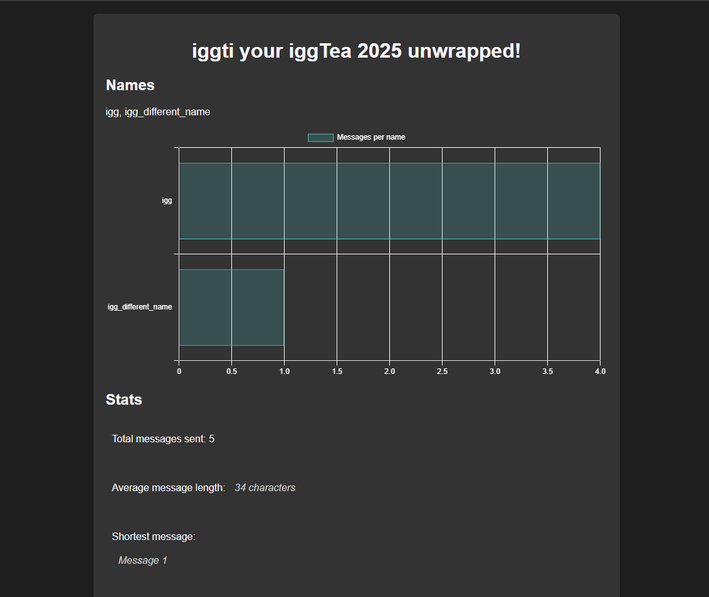

# Introduction

Diggcord is a Discord bot, intended to produce an end-of-year Discord Unwrapped page for each opted-in user.

# Download

Compiled downloads are not available.

# Compiling

To clone and run this application, you'll need [Git](https://git-scm.com) and [.NET](https://dotnet.microsoft.com/) installed on your computer. From your command line:

```
# Clone this repository
$ git clone https://github.com/btigi/ContentSearchExtended

# Go into the repository
$ cd src

# Build  the app
$ dotnet build
```

# Installation

## Diggcord.DiscordBot
The discord bot. The project can be run as a console application or, for more long term use, as a Windows Service.

To install as a Windows Service:

`sc create Diggcord.DiscordBot binPath= "C:\path\to\your\Diggcord.DiscordBot.exe"`

To start the Windows Service (you may want to edit the service to start automatically):

`sc start Diggcord.DiscordBot`

To delete the Windows Service:

`sc delete Diggcord.DiscordBot`


## Diggcord.DiscordUnwrapped.Web
The website responsible for producing the output webpage.


# Configuration

## Diggcord.DiscordBot
The appsettings.json file contains three settings:
 - DbPath - the full path to the SQLite database. The file will be created if it does not exist.
 - Image Path - the full path to save server emote images to. This should be /wwwroot/images in the Diggcord.DiscordUnwrapped.Web folder.
 - DiscordToken - the Discord bot token.


## Diggcord.DiscordUnwrapped.Web
The appsettings.json file contains one relevant setting:
 - DbPath - the full path to the SQLite database. The file will be created if it does not exist.


# Usage
In order to produce the unwapped page Diggcord logs all messages for opted-in users.

A user must opt-in to have their messages logged, they do this by sending a message containing only the word `optin`.

A user can opt-out of having their messages logged at any time, they do this by sending a message containing only the word `optout`. This will immediately stop logged all messages for the user and delete all historic data.

`optin` and `optout` operate per guild.


# Output
The access the output webpage call the `unwrapped` endpoint providing the authorId, year and guildId, e.g. https://localhost:7227/unwrapped?authorid=205010526827315200&year=2025&guildid=339465627263565834

The page includes visuali\ations on:
- Names used by the user
- Number of messages sent by each name
- Total number of messages
- Average message length
- Messages by time of day
- Messages by month
- Messages by channel
- Top 5 most used server emotes
- All server emotes
- All emotes
- Milestones (number of days to send 1, 10, 100, 10000, 100000, 1000000 and 10000000 messages)
- Wordcloud

The page automtically renders in the user's preferred light/dark mode.




# Licencing

Diggcord is licenced under CC BY-NC-ND 4.0 https://creativecommons.org/licenses/by-nc-nd/4.0/ Full licence details are available in licence.md